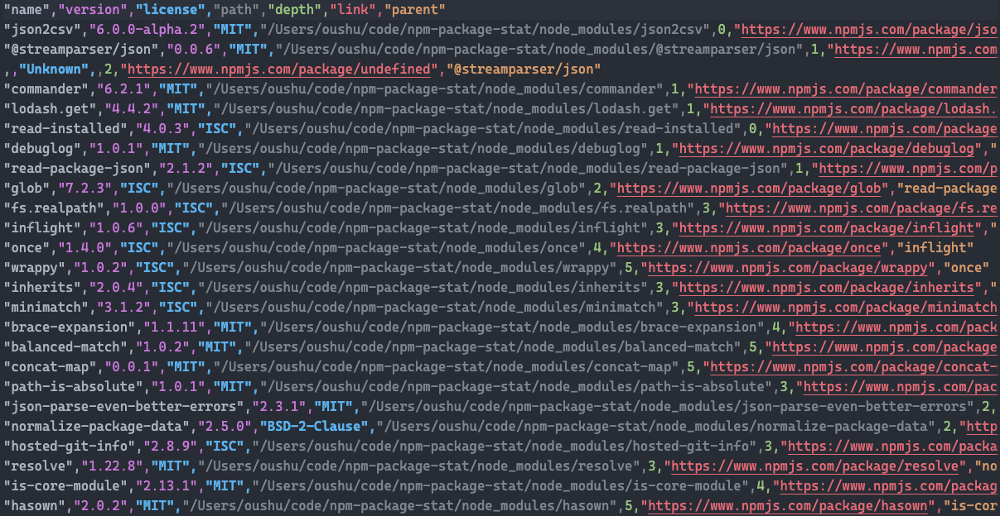

# npm-package-stat
A command line tool to generate npm package statistics with csv format

## Installation

```bash
npm i -g npm-package-stat
```

## Usage

### basic

```bash
npm-package-stat <path/to/project1> <path/to/project2> ...
```



### with options

```bash
npm-package-stat -D /path/to/project # Only extract devDependencies
npm-package-stat -D -O /path/to/project # Only extract devDependencies and optionalDependencies
```

```
-S             Only include dependencies                
-D             Only include devDependencies             
-O             Only include optionalDependencies        
-P             Only include peerDependencies            
```